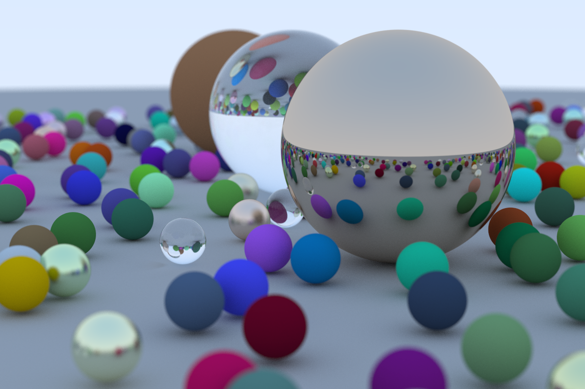

# MyRayTracingInOneWeekend

My practice code and some note of [**_Ray Tracing in One Weekend_**](https://raytracing.github.io/books/RayTracingInOneWeekend.html) (Version 3.2.3, 2020-12-07, acknowledged as and short for **rtweekend**)

## Proof of perpendicular part of refracted ray formula

In section _10.2. Snell‘s Law_, there is a formula:

$\mathrm{R}_{\perp}^{\prime}=\frac{\eta}{\eta^{\prime}}(\mathrm{R}+\cos \theta n)$

How to reach this formula? Below lies the proof procedure:

Before starting, we need to realize that the incident ray vector and the refracted ray vector are both unit vectors.

According to the Snell's law:

$\eta \cdot \sin \theta=\eta^{\prime} \cdot \sin \theta^{\prime}$

Unfold the $\sin \theta$ and the $\sin\theta^{\prime}$, yielding:

$\eta \cdot \frac{\|\mathrm{R}_{\perp}\|}{\|\mathrm{R}\|} = \eta^{\prime} \cdot \frac{\|\mathrm{R}_{\perp}^{\prime}\|}{\|\mathrm{R}^{\prime}\|}$

$\because \|\mathrm{R}\|=\|\mathrm{R}^{\prime}\|=unit \space vector$

$\therefore \|\mathrm{R}_{\perp}^{\prime}\|=\frac{\eta}{\eta^{\prime}}\|\mathrm{R}_{\perp}\|$

$\because \mathrm{R}_{\perp}^{\prime}$ and $\mathrm{R}_{\perp}$ are in the same direction

$\therefore \mathrm{R}_{\perp}^{\prime}=\frac{\eta}{\eta^{\prime}}\mathrm{R}_{\perp} \space \cdots \space \cdots (1)$

$\because \|\mathrm{R}_{\parallel}\|=\|\mathrm{R}\| \cdot \cos \theta$ , $\|\mathrm{R}\|=\|\mathrm{n}\|=unit \space vector$

$\therefore \|\mathrm{R}_{\parallel}\|=\|\mathrm{n}\| \cdot \cos \theta$

$\because \mathrm{R}$ and $\mathrm{n}$ are in the opposite direction

$\therefore \mathrm{R}_{\parallel}=-\mathrm{n} \cdot \cos \theta$

$\because \mathrm{R}_{\perp}=\mathrm{R}-\mathrm{R}_{\parallel}$

$\therefore \mathrm{R}_{\perp}=\mathrm{R}+\mathrm{n}\cdot \cos \theta \space \cdots \space \cdots (2)$

Combine the formula (1) and the formula (2), yielding:

$\mathrm{R}_{\perp}^{\prime}=\frac{\eta}{\eta^{\prime}}(\mathrm{R}+\cos \theta n)$

Proof complete.

## Tips

The final code in section 13 might take your computer hours to run and get the result image. (I use a Virtual Box VM with 4 CPUs of i7-8750h and it takes about 15 hours to complete)

Manage your time and good luck.

My rtweekend image:

